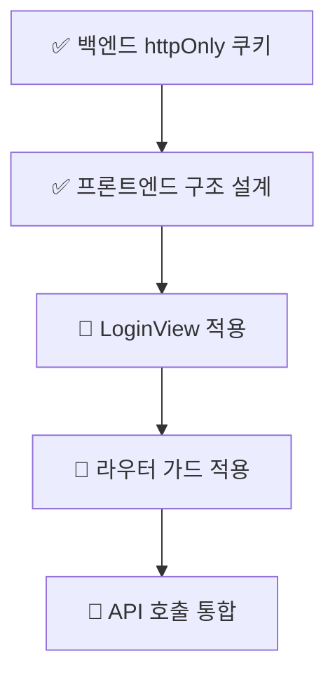
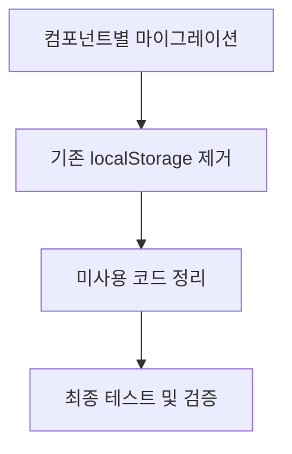
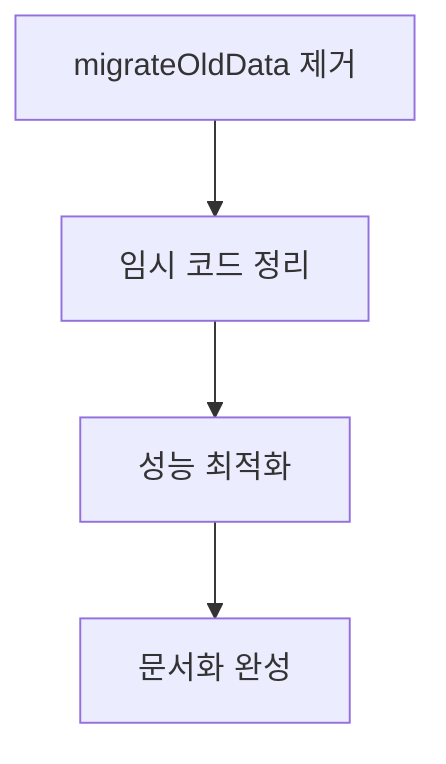

# GENIE 보안 우선 인증 시스템 마이그레이션 완전 가이드

## 📋 목차
1. [현재 완성된 구조 분석](#현재-완성된-구조-분석)
2. [마이그레이션 로드맵](#마이그레이션-로드맵)
3. [Task별 상세 계획](#task별-상세-계획)
4. [향후 정리 작업](#향후-정리-작업)
5. [Composables 활용 전략](#composables-활용-전략)
6. [코드 품질 개선 방향](#코드-품질-개선-방향)

---

## 🏗️ 현재 완성된 구조 분석

### **✅ 완성된 파일들의 목적과 역할**

#### **1. `/src/stores/auth.js` - 보안 우선 상태 관리**
```javascript
목적: 메모리 기반 토큰 저장 및 httpOnly 쿠키 연동
핵심 기능:
- accessToken: 메모리에만 저장 (XSS 완전 차단)
- 자동 토큰 갱신 (refreshToken)
- 기존 데이터 마이그레이션 (migrateOldData)
- 사용자 정보 관리 (autoLogin 설정별)

🔄 마이그레이션 대상:
- initializeAuth() → 모든 페이지 로드 시 호출
- migrateOldData() → 임시 코드 (추후 제거 예정)
```

#### **2. `/src/utils/api.js` - 통합 API 시스템**
```javascript
목적: 자동 토큰 갱신 및 401 에러 처리
핵심 기능:
- apiRequest(): 기본 API 요청 + 자동 토큰 갱신
- HTTP 메서드별 편의 함수 (apiGet, apiPost 등)
- 인증 전용 API (loginAPI, logoutAPI)
- 에러 처리 통합 (APIError, getErrorMessage)

🔄 마이그레이션 대상:
- 모든 fetch() 호출을 api 함수로 대체
- 기존 수동 토큰 관리 로직 제거
```

#### **3. `/src/composables/useAuth.js` - Vue Composition API**
```javascript
목적: 재사용 가능한 인증 로직
핵심 기능:
- useAuth(): 전체 인증 기능
- useAuthState(): 상태 전용 (읽기 전용)
- useAuthToken(): 토큰 관리 전용
- useAuthGuard(): 라우터 가드 전용

🔄 마이그레이션 대상:
- 컴포넌트에서 authStore 직접 사용 → useAuth() 사용
- 분산된 인증 로직 → composable로 통합
```

---

## 🗺️ 마이그레이션 로드맵

### **Phase 1: 핵심 컴포넌트 적용 (현재 진행 중)**


### **Phase 2: 전체 시스템 마이그레이션**


### **Phase 3: 최적화 및 정리**


---

## 📝 Task별 상세 계획

### **🔄 현재 진행 중인 Task들**

#### **Task 2: LoginView 보안 우선 인증 로직 적용**
```javascript
// 현재 상태: 진행 대기 중
// 목표: LoginView.vue를 새로운 시스템에 맞게 수정

// 변경 사항:
// 기존:
const res = await fetch("/api/auth/select/login", {
    method: "POST",
    headers: { "Content-Type": "application/json" },
    credentials: "include",
    body: JSON.stringify({ memEmail, memPassword }),
});

// 새로운 방식:
import { useAuth } from '@/composables/useAuth';
const { login, isLoading, error } = useAuth();
const success = await login(email, password, autoLogin);

// 제거할 코드:
// - 직접 fetch 호출
// - localStorage.setItem("authUser", ...)
// - sessionStorage.setItem("authUser", ...)
// - 수동 에러 처리
```

#### **Task 3: 라우터 가드 보안 우선 인증 적용**
```javascript
// 현재 상태: 진행 대기 중
// 목표: router/index.js의 requireAuth 가드 수정

// 변경 사항:
// 기존: 복잡한 localStorage 체크 로직
// 새로운 방식:
import { useAuthGuard } from '@/composables/useAuth';
const { checkAuth } = useAuthGuard();

const requireAuth = async (to, from, next) => {
    const isAuthenticated = await checkAuth();
    if (isAuthenticated) {
        next();
    } else {
        next('/login');
    }
};

// 제거할 코드:
// - localStorage.getItem("authUser") 직접 호출
// - sessionStorage 수동 체크
// - 서버 세션 확인 fetch 로직 (이제 토큰 기반)
```

#### **Task 4: API 호출 시스템 통합 및 자동 토큰 갱신**
```javascript
// 현재 상태: 진행 대기 중
// 목표: 모든 API 호출을 통합 시스템으로 마이그레이션

// 마이그레이션 대상 파일들:
1. /views/mypage/Info.vue
2. /views/mypage/Ticket.vue
3. /views/generation/* (모든 생성 관련 컴포넌트)
4. /views/storage/* (모든 저장소 관련 컴포넌트)

// 변경 패턴:
// 기존:
const response = await fetch('/api/info/select/ticket', {
    method: "GET",
    headers: authStore.getApiHeaders(),
});

// 새로운 방식:
import { apiGet } from '@/utils/api';
const data = await apiGet('/api/info/select/ticket');
// 자동 토큰 갱신, 에러 처리 포함
```

### **🆕 추가 필요한 Task들**

#### **Task 7: 컴포넌트별 세부 마이그레이션 작업**
```javascript
// 우선순위 높은 컴포넌트들:

1. 📱 Layout 컴포넌트들
   - /views/layout/Sidebar.vue (사용자 정보 표시)
   - /views/layout/Frame.vue (인증 상태 체크)

2. 🔐 인증 관련 컴포넌트들
   - /views/member/PasswordSearch.vue
   - /views/member/SingUpPage.vue
   - /components/mypage/ChangePasswordModal.vue

3. 📊 데이터 표시 컴포넌트들
   - /views/mypage/MyPageContent.vue
   - /views/main/MainHome.vue
   - /components/generation/PaymentUsageModal.vue

// 마이그레이션 패턴:
// useAuth 또는 useAuthState 사용
// 직접 authStore 접근 → composable 사용
// fetch 직접 호출 → api 함수 사용
```

#### **Task 8: 기존 localStorage 의존성 완전 제거**
```javascript
// 목표: 모든 토큰 관련 localStorage 사용 제거

// 제거 대상 코드 패턴:
1. localStorage.getItem('token')
2. localStorage.setItem('token', ...)
3. localStorage.getItem('authTokens')
4. sessionStorage.getItem('authTokens')

// 검색하여 찾을 키워드:
- "localStorage" + "token"
- "sessionStorage" + "auth"
- "getItem('token"
- "setItem('token"

// 안전하게 유지할 localStorage 사용:
- localStorage.getItem('authUser') ✅ (사용자 정보)
- localStorage.getItem('autoLogin') ✅ (설정값)
```

#### **Task 9: 임시 마이그레이션 코드 정리**
```javascript
// 모든 마이그레이션 완료 후 제거할 코드들:

1. auth.js에서 제거:
   - migrateOldData() 메서드
   - clearAllStorageData()에서 'token', 'authTokens' 정리 로직
   - 기존 호환성 관련 주석들

2. 개발 디버그 코드 제거:
   - console.log('=== 보안 우선 인증 초기화 ===')
   - 과도한 디버그 로그들
   - 임시 주석들

3. 미사용 함수 제거:
   - setUser() (세션 로그인용 - 더 이상 사용 안함)
   - 기존 방식 관련 getter들
```

#### **Task 10: 성능 최적화 및 코드 품질 개선**
```javascript
// 최적화 대상:

1. Bundle Size 최적화:
   - 미사용 import 제거
   - Tree shaking 최적화
   - Composable 분할 로딩

2. 메모리 최적화:
   - setTimeout 정리 (토큰 갱신 스케줄러)
   - Event listener 정리
   - Component unmount 시 정리

3. 타입 안전성:
   - JSDoc → TypeScript 마이그레이션 고려
   - API 응답 타입 정의
   - 에러 타입 구체화
```

---

## 🧹 향후 정리 작업

### **즉시 제거 가능한 코드들**

#### **1. 기존 토큰 저장 방식**
```javascript
// ❌ 제거 대상 (보안 취약)
localStorage.setItem('token', jwtToken);
sessionStorage.setItem('authTokens', JSON.stringify(tokens));

// ✅ 새로운 방식 (이미 구현됨)
authStore.setTokens(loginResponse); // 메모리에만 저장
// refresh token은 httpOnly 쿠키로 자동 관리
```

#### **2. 수동 토큰 갱신 로직**
```javascript
// ❌ 제거 대상 (복잡하고 에러 발생 가능)
if (response.status === 401) {
    // 수동으로 토큰 갱신 시도
    const refreshResponse = await fetch('/api/auth/refresh');
    // ... 복잡한 에러 처리
}

// ✅ 새로운 방식 (이미 구현됨)
const data = await apiGet('/api/some-endpoint');
// 401 에러 시 자동 토큰 갱신 및 재시도
```

### **단계별 제거 계획**

#### **Phase 1: 컴포넌트 마이그레이션 완료 후**
```javascript
// 1. 직접 fetch 호출 제거
// 2. localStorage 토큰 접근 제거  
// 3. 수동 인증 체크 로직 제거

// 자동 검증 스크립트 (실행 가능):
grep -r "localStorage.*token" src/
grep -r "sessionStorage.*auth" src/  
grep -r "fetch.*api" src/ | grep -v "utils/api"
```

#### **Phase 2: 마이그레이션 코드 정리**
```javascript
// auth.js에서 제거:
migrateOldData() {
    // ❌ 이 전체 메서드 제거
}

clearAllStorageData() {
    // ❌ 'token', 'authTokens' 관련 라인 제거
    localStorage.removeItem('token'); // 이 라인 제거
    sessionStorage.removeItem('authTokens'); // 이 라인 제거
}
```

#### **Phase 3: 최종 정리**
```javascript
// 1. 과도한 디버그 로그 제거
console.log('=== 보안 우선 인증 초기화 ==='); // 제거

// 2. 임시 주석 제거
// TODO: 기존 방식과 호환성... // 제거

// 3. 미사용 import 제거
import { useRouter } from 'vue-router'; // 사용하지 않으면 제거
```

---

## 🧩 Composables 활용 전략

### **재사용성 극대화**

#### **1. 컴포넌트 타입별 Composable 선택 가이드**
```javascript
// 🔐 로그인/로그아웃이 필요한 컴포넌트
import { useAuth } from '@/composables/useAuth';
// 예: LoginView.vue, 로그아웃 버튼

// 📊 사용자 정보만 표시하는 컴포넌트  
import { useAuthState } from '@/composables/useAuth';
// 예: Sidebar.vue, 사용자 정보 표시

// 🔒 토큰 정보가 필요한 유틸리티
import { useAuthToken } from '@/composables/useAuth';
// 예: API 호출 전 토큰 체크

// 🛡️ 라우터 가드 전용
import { useAuthGuard } from '@/composables/useAuth';
// 예: router/index.js, 페이지 가드
```

#### **2. 컴포넌트별 적용 예시**
```vue
<!-- 🔐 전체 기능이 필요한 컴포넌트 -->
<script setup>
import { useAuth } from '@/composables/useAuth';

const { 
    login, logout, 
    isLoggedIn, user, 
    isLoading, error 
} = useAuth();
</script>

<!-- 📊 상태만 필요한 컴포넌트 -->
<script setup>
import { useAuthState } from '@/composables/useAuth';

const { isLoggedIn, user, userTicketCount } = useAuthState();
</script>

<!-- 🔒 토큰만 필요한 유틸리티 -->
<script setup>
import { useAuthToken } from '@/composables/useAuth';

const { hasValidToken, refreshToken } = useAuthToken();
</script>
```

### **코드 중복 제거 전략**

#### **Before: 분산된 인증 로직**
```javascript
// ❌ 각 컴포넌트마다 중복된 코드
// LoginView.vue
const authStore = useAuthStore();
if (loginSuccess) {
    authStore.setUser(userData);
    localStorage.setItem("authUser", JSON.stringify(userData));
}

// Sidebar.vue  
const authStore = useAuthStore();
const user = computed(() => authStore.user);

// MyPage.vue
const authStore = useAuthStore();
await authStore.updateTicketCount();
```

#### **After: Composable로 통합**
```javascript
// ✅ 하나의 composable로 모든 로직 통합
// 모든 컴포넌트에서
import { useAuth } from '@/composables/useAuth';
const { login, user, updateTicketCount } = useAuth();
```

---

## 📈 코드 품질 개선 방향

### **1. 타입 안전성 강화**
```javascript
// 현재: JSDoc 기반
/**
 * @param {string} email
 * @param {string} password  
 * @returns {Promise<boolean>}
 */
async function login(email, password) { }

// 향후: TypeScript 마이그레이션 고려
interface LoginCredentials {
    email: string;
    password: string;
}

async function login(credentials: LoginCredentials): Promise<boolean> { }
```

### **2. 에러 처리 표준화**
```javascript
// 현재: APIError 클래스 기반
try {
    await apiGet('/api/endpoint');
} catch (error) {
    if (error instanceof APIError) {
        // 표준화된 에러 처리
    }
}

// 향후: 에러 바운더리 패턴
// composable에서 에러 상태 자동 관리
const { data, error, isLoading } = useApi('/api/endpoint');
```

### **3. 테스트 가능성 향상**
```javascript
// Composable 기반 설계로 테스트 용이
// 유닛 테스트
import { useAuth } from '@/composables/useAuth';

test('로그인 성공 시 사용자 정보 설정', async () => {
    const { login, user } = useAuth();
    await login('test@example.com', 'password');
    expect(user.value).toBeDefined();
});
```

### **4. 성능 모니터링**
```javascript
// 향후 추가 고려사항
// 토큰 갱신 횟수 모니터링
// API 요청 실패율 추적
// 메모리 사용량 모니터링

// 예시: 개발 환경에서만 성능 로그
if (import.meta.env.DEV) {
    console.time('토큰 갱신 시간');
    await refreshToken();
    console.timeEnd('토큰 갱신 시간');
}
```

---

## 🎯 최종 목표 및 기대 효과

### **보안성**
- ✅ XSS 공격 완전 차단
- ✅ CSRF 공격 방어  
- ✅ 토큰 탈취 피해 최소화

### **개발 생산성**
- ✅ 통합된 API 시스템
- ✅ 재사용 가능한 Composable
- ✅ 자동화된 에러 처리

### **유지보수성**
- ✅ 관심사 분리
- ✅ 중앙화된 상태 관리
- ✅ 표준화된 코드 패턴

### **사용자 경험**
- ✅ 투명한 토큰 갱신
- ✅ 끊김없는 인증 플로우
- ✅ 빠른 페이지 로드